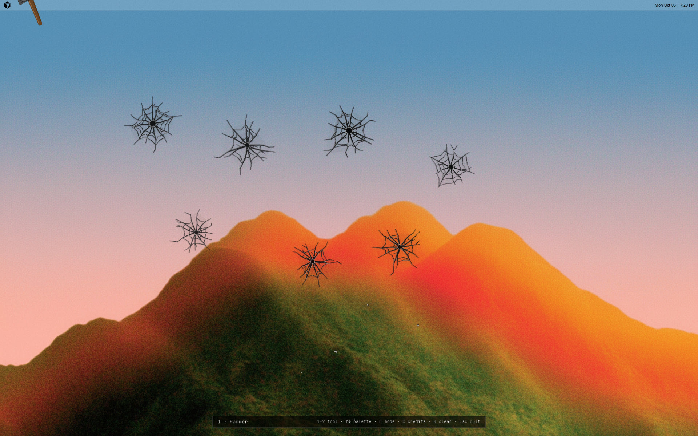
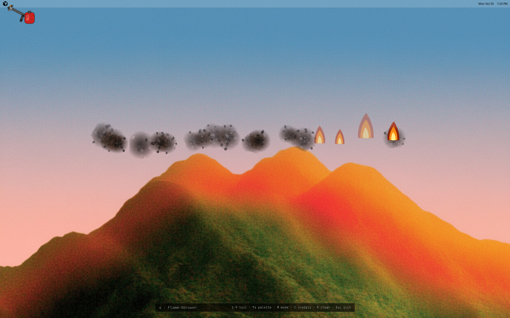
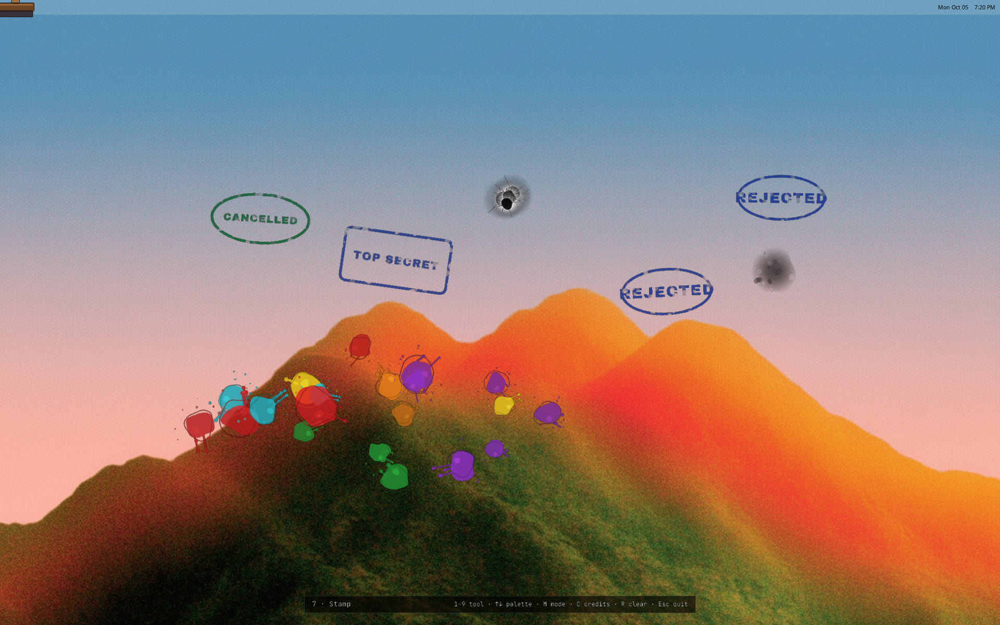
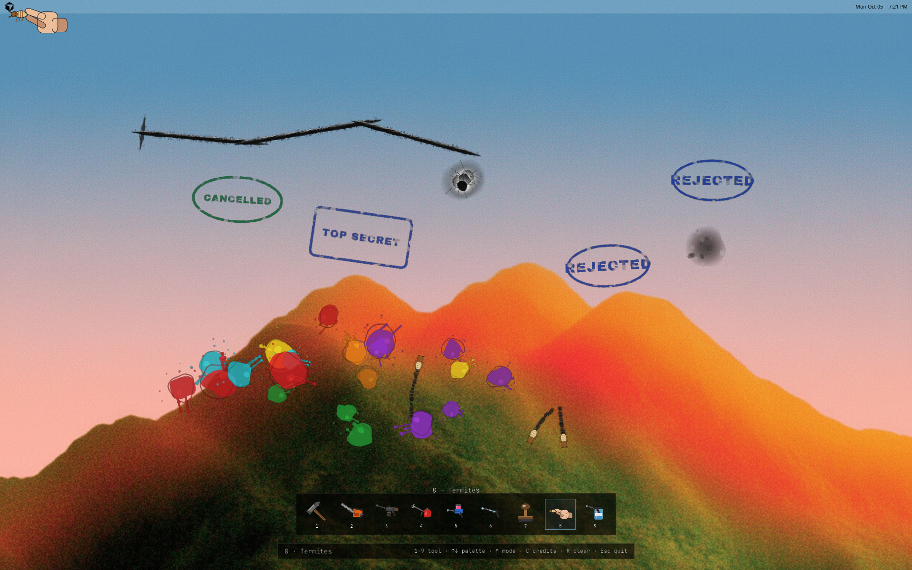

# Hakai (破壊)

Smash, burn, shoot, paint and squish your live desktop with nine tools, then watch it
wander off on its own (termites) or wipe it clean again (the washer).

## Download

**[Download the game](https://github.com/matjaz/hakai/releases)** — Linux, Windows, macOS, and Android.

| Platform | What you get |
|---|---|
| Linux | `.deb`, `.rpm`, or tarball — [install notes](hakai-linux/README.md) |
| Windows 10/11 | portable `.zip` — [notes](hakai-win/README.txt) |
| macOS 11+ | universal `.dmg` — [notes](hakai-mac/README.txt) |
| Android 8+ | `.apk` — [notes](hakai-android/README.md) |

Hakai is Japanese for *destruction*. It's a reimplementation of
[Desktop Destroyer](http://www.breatharian.eu/Petr/en/program/misc.htm) by Miroslav
Němeček — written independently, not a code fork. A transparent overlay sits on the
desktop you already have. Fonts and sounds are credited in [`CREDITS.md`](CREDITS.md).

## What it does

A full-screen, always-on-top, transparent overlay covers your real desktop — one per
monitor. `Esc` always gets you out, and the keys you already use to switch apps still
work. Nine tools, each a faithful port of the original's own behaviour:

| Key | Tool | What it does |
|---|---|---|
| `1` | Hammer | Cracks the desktop where you strike, with a satisfying knock animation |
| `2` | Chain-saw | Cuts continuously while dragged; revs up with movement, not just the button |
| `3` | Machine gun | Punches bullet holes, ejects shells, flashes on fire |
| `4` | Flame-thrower | Leaves standing fires that spread, flicker, and burn out into scorch marks — and keep doing all of that even after you switch tools |
| `5` | Color-thrower | Splats paint |
| `6` | Phaser | A sustained beam |
| `7` | Stamp | Stamps a random bureaucratic verdict (`REJECTED`, `APPROVED`, `TOP SECRET`, ...) |
| `8` | Termites | Releases bugs that wander the desktop and eat it, one bite at a time |
| `9` | Washer | The only repair tool — wipes damage away along the stroke (blocked by living termites) |

`Tab` / `Shift+Tab` cycles tools, `↑`/`↓` opens and closes the tool palette, `M` freezes
the view to a snapshot (so the *real* desktop underneath can keep changing without
disturbing what you're smashing), `C` opens the credits panel, `R` clears everything.
On Android, touch replaces the keyboard — see [hakai-android](hakai-android/README.md).

The impact sound follows the brightness of whatever's under the cursor: hollow on dark,
glassy on light, like the original. Where the screen can't be read, a random variant is
used instead.

| Hammer | Flame-thrower |
| --- | --- |
|  |  |
| **Paint, bullets, and stamps** | **Tool palette and termites** |
|  |  |

## License

MIT — see [`LICENSE`](LICENSE). That covers this repository's own source only; the
bundled fonts (SIL OFL 1.1) and sounds (a mix of CC BY 4.0 / CC0 / Public Domain) are
separately licensed — see [`CREDITS.md`](CREDITS.md) for the full per-file breakdown.
Behaviour is derived from Desktop Destroyer by Miroslav Němeček; no code or asset from the
original is included here.

Building from source: [Linux](hakai-linux/README.md), [Windows](hakai-win/README.txt),
[macOS](hakai-mac/README.txt), [Android](hakai-android/README.md), and the shared
[core](hakai-core/README.md).
