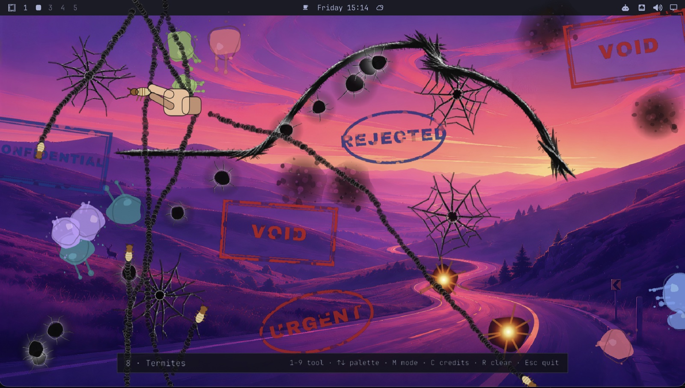

# Hakai (破壊)

A native desktop-destruction toy for **Linux** (Wayland/Hyprland, made for **Omarchy**),
**Windows** and **macOS** — smash, burn, shoot, paint and squish your live desktop with
nine tools, then watch it wander off on its own (termites) or wipe it clean again (the
washer).

Hakai is Japanese for *destruction*. It's a Rust/`wgpu` reimplementation of
[Desktop Destroyer](http://www.breatharian.eu/Petr/en/program/misc.htm) by Miroslav
Němeček — written independently, not a code fork. One shared core (every tool, the
renderer, the scene, a winit window shell) runs under thin native front ends: a
`wlr-layer-shell` overlay on Hyprland and friends, fullscreen windows on GNOME and X11, a
DirectComposition overlay on Windows, and a Metal overlay on macOS. See
[`CREDITS.md`](CREDITS.md) for the full sound/font attribution.

| Platform | Get it | Notes |
|---|---|---|
| Linux | [Releases](https://github.com/matjaz/hakai/releases) `.deb`, `.rpm` or tarball (x86_64, aarch64), or `makepkg` | Any Wayland or X11 desktop; native overlay on Hyprland, Sway, KDE Plasma, …; Omarchy theme colours |
| Windows 10/11 | [Releases](https://github.com/matjaz/hakai/releases) `.zip` (x86_64) | Portable, unsigned — SmartScreen shows once |
| macOS 11+ | [Releases](https://github.com/matjaz/hakai/releases) `.dmg` (universal) | Not notarised — *Open Anyway* once |

## What it does

A full-screen, always-on-top, transparent overlay sits above your real desktop — one per
monitor — and takes the keyboard (`Esc` always gets you out; on Hyprland the compositor's
own `SUPER` binds still work underneath it, on Windows Alt+Tab and the Windows key do, on
macOS ⌘Q quits too). Nine tools, each a faithful port of the original's own behaviour:

| Key | Tool | What it does |
|---|---|---|
| `1` | Hammer | Cracks the desktop where you strike, with a satisfying knock animation |
| `2` | Chain-saw | Cuts continuously while dragged; revs up with movement, not just the button |
| `3` | Machine gun | Punches bullet holes, ejects shells, flashes on fire |
| `4` | Flame-thrower | Leaves standing fires that spread, flicker, and burn out into scorch marks — and keep doing all of that even after you switch tools |
| `5` | Color-thrower | Splats paint — in your active Omarchy theme's own colours on Omarchy |
| `6` | Phaser | A sustained beam |
| `7` | Stamp | Stamps a random bureaucratic verdict (`REJECTED`, `APPROVED`, `TOP SECRET`, ...) |
| `8` | Termites | Releases bugs that wander the desktop and eat it, one bite at a time |
| `9` | Washer | The only repair tool — wipes damage away along the stroke (blocked by living termites) |

Plus: `Tab` / `Shift+Tab` cycles tools, `↑`/`↓` opens/closes the tool palette, `M` freezes
the view to a snapshot (so the *real* desktop underneath can keep changing without
disturbing what you're smashing), `C` opens the credits panel, `R` clears everything.

The impact sound follows the brightness of whatever's under the cursor (hollow on dark,
glassy on light), like the original — each platform reads the screen its own way
(`wlr-screencopy`, DXGI Desktop Duplication, CoreGraphics), and falls back to a random
variant where it can't.



## Installing

**Windows and macOS:** see [Windows](#windows) and [macOS](#macos) below — download, run.

### Linux

Runs on any Wayland or X11 desktop, two ways:

- **Native overlay** — a `wlr-layer-shell` surface with an exclusive keyboard grab, on
  Hyprland (the one it's built and tested on), Sway, river, labwc, Wayfire, niri, KDE
  Plasma 6 and COSMIC. The brightness-driven impact sound reads the screen with
  `wlr-screencopy` where there is one (wlroots compositors, Hyprland, niri).
- **Fallback** — on GNOME (no layer-shell) and in X11 sessions, hakai opens ordinary
  fullscreen transparent windows instead, one per monitor — the same winit shell the
  Windows and macOS builds use. Alt+Tab and the Super key still reach the desktop, the
  impact sound picks a random variant, and on X11 transparency needs a compositing window
  manager (every mainstream desktop has one; bare i3 without picom shows black).

It picks automatically; `HAKAI_BACKEND=winit` forces the fallback, and `WGPU_BACKEND=gl`
or `vulkan` pins the graphics backend if a driver misbehaves (the fallback uses Vulkan on
Wayland and GL on X11 by default).

One binary per architecture serves every distro — it's built on Ubuntu 22.04, so it needs
glibc 2.35+ (Ubuntu 22.04+, Debian 12+, Fedora 36+). From the
[releases page](https://github.com/matjaz/hakai/releases):

```bash
sudo apt install ./hakai_<version>-1_amd64.deb        # Debian, Ubuntu, Mint, …
sudo dnf install ./hakai-<version>-1.x86_64.rpm       # Fedora, openSUSE (zypper), …
```

(`arm64`/`aarch64` for ARM.) Or the tarball, `hakai-<version>-<arch>-linux.tar.gz` —
the binary, a `.desktop` entry and its icon: `install -Dm755 hakai ~/.local/bin/hakai`,
plus `hakai.desktop` → `~/.local/share/applications/` and `hakai.png` →
`~/.local/share/icons/hicolor/256x256/apps/` for a launcher entry. Either way it needs
`libxkbcommon`, ALSA's `libasound`, `libwayland-client` and a Vulkan driver at runtime (plus
EGL for the X11 fallback) — the packages pull them in.

On Arch / Omarchy, it's not yet on the AUR (registration is currently locked down repo-wide after a wave of
malicious package uploads in mid-2026 — nothing to do with this package specifically;
submission will follow once that reopens). Until then, install directly with `makepkg`,
using the `PKGBUILD` already in this repo — confirmed working end to end on real
QEMU/aarch64 Omarchy hardware:

```bash
git clone https://github.com/matjaz/hakai.git
cd hakai/packaging
makepkg -si
```

This builds both crates, generates the app icon procedurally (no bundled bitmap assets —
see [Layout](#layout)), and installs the binary, `.desktop` entry, icon, license, and
docs via `pacman`, so it's a real tracked package (`pacman -Q hakai-git`), not a stray
binary. `pkgrel`/dependencies/install paths are all in
[`packaging/PKGBUILD`](packaging/PKGBUILD) if you want to read exactly what it does
before running it.

If `makepkg` is invoked from a network-mounted checkout of this repo (e.g. developing
over a shared/virtiofs mount, as this project's own dev loop does), set `BUILDDIR`
somewhere local first — network mounts have caused real, documented build failures here
(`PHASE0.md`, `PHASE8.md`):

```bash
BUILDDIR="$HOME/.cache/hakai-git-build" makepkg -si
```

## Building from source (development)

For working on the Linux binary itself, rather than installing it (the Windows and macOS
build commands are in their own sections below):

```bash
cd hakai
cargo build --release
cargo run --release
```

`hakai-core` — the headless raster/game-logic core (damage layer, decal/icon/sprite
generators, all nine tools, the termite colony, particle system) — builds and tests on
any OS, no compositor needed:

```bash
cd hakai-core
cargo test
```

A suggested Hyprland keybind (not applied automatically — see
[`packaging/hyprland-bindings.conf.example`](packaging/hyprland-bindings.conf.example) for
both the current Lua form and the classic hyprlang one, depending on your Hyprland
version). On a current Omarchy install (Hyprland 0.55+, Lua config), add this to
`~/.config/hypr/bindings.lua` — not `bindings.conf`, which nothing loads once you're on
Lua — then `hyprctl reload`:

```lua
o.bind("SUPER + SHIFT + H", "Destroy the desktop", "uwsm app -- hakai")
o.bind("SUPER + SHIFT + ALT + H", "Stop destroying it", "pkill -x hakai")
```

## Windows

`hakai-win/` is the Windows build — a separate binary crate against the same
`hakai-core`. It's a transparent Direct3D 12 overlay (one per monitor) with the
same nine tools, `cpal`/WASAPI audio, and DXGI Desktop Duplication standing in for
`wlr-screencopy`. `theme.rs` is stubbed — it ships the built-in palette, since Windows has
no coherent system theme to read.

Download the portable `.zip` from the releases page (or build it — see below), extract it
anywhere, and run `hakai-win.exe`. Nothing to install; the fonts and all 35 sounds are
compiled into the binary. It's unsigned, so SmartScreen shows once — *More info* → *Run
anyway*. See [`hakai-win/README.txt`](hakai-win/README.txt) for the key list and notes.

Building it needs the MSVC toolchain (`rustup` picks `x86_64-pc-windows-msvc` by default;
install "Desktop development with C++" from the VS Build Tools):

```powershell
cargo run  --release --manifest-path hakai-win/Cargo.toml   # run it
powershell -File hakai-win/package.ps1                       # build the release zip
```

All three binaries build against `wgpu` 30 (the Windows side forced the bump — wgpu 22's D3D12
backend can't present a per-pixel-alpha surface to a plain window, and the
`DirectComposition` path that can only landed later; Linux and macOS followed). The
renderer and the whole per-output scene live in `hakai_core::render`, behind the crate's
off-by-default `render` feature, and the winit shell (windows per monitor, event loop,
keyboard/pointer routing) in `hakai_core::shell` behind `shell`. Windows and macOS are just
a `Platform` impl on that shell — their backend, native window styling and screen-capture
backend (DXGI Desktop Duplication, `CGWindowListCreateImage`); the Linux binary keeps its
own Wayland event loop for the layer-shell overlay (`zwlr_screencopy_v1` capture) and uses
the shell for its GNOME/X11 fallback.

See `WINDOWS-PORT.md` (analysis) and `WINDOWS-PLAN.md` (the phased build log) for the full
story.

## macOS

`hakai-mac/` is the macOS build — a third binary crate on `hakai-core`'s shared renderer,
scene and winit shell, like `hakai-win`. Metal draws into a non-opaque
`CAMetalLayer`; the overlay is lifted to the screensaver window level so it
covers the menu bar and the Dock too, on every Space and every display (the recipe from
the Swift original's `OverlayWindow`). The brightness-driven impact sound reads the screen
with `CGWindowListCreateImage`, excluding the overlay itself — that needs the *Screen
Recording* permission; without it a random variant is used, as everywhere else.

Download the `.dmg` from the releases page, drag *Hakai* to Applications. It's a universal
binary (Apple silicon + Intel, macOS 11+), ad-hoc signed rather than notarised, so the
first launch needs *System Settings → Privacy & Security → Open Anyway*. See
[`hakai-mac/README.txt`](hakai-mac/README.txt) for the key list and notes.

```sh
cargo run --release --manifest-path hakai-mac/Cargo.toml   # run it
hakai-mac/package.sh                                        # build the universal release DMG
```

## Releases

CI builds and packages every platform on each push — Linux `.deb`, `.rpm` and tarball
(x86_64, aarch64; one build each, wrapped three ways by
[nfpm](https://nfpm.goreleaser.com)), the Windows zip and the universal macOS DMG — and keeps them as workflow artifacts for two
weeks. Pushing a `v*` tag additionally publishes those same artifacts (plus `SHA256SUMS`)
as a GitHub release, without rebuilding anything. The tag has to match the crates'
`version` (`v1.0.0` ↔ `1.0.0` in `hakai`, `hakai-win` and `hakai-mac`), or the release
job refuses.

```sh
git tag v1.0.0 && git push origin v1.0.0
```

## Layout

```
hakai/         the Linux binary — wlr-layer-shell surfaces, Wayland input, cpal audio,
               wlr-screencopy capture, Omarchy theme integration, and the winit fallback
               for GNOME/X11; package.sh → tarball, .deb, .rpm
hakai-win/     the Windows binary — a DirectComposition overlay, winit, DXGI Desktop
               Duplication; package.ps1 → portable zip
hakai-mac/     the macOS binary — a screensaver-level Metal overlay, winit, CoreGraphics
               capture; package.sh → universal DMG
hakai-core/    the shared library — headless by default (tiled damage layer, procedural
               decal/icon/sprite generators, all nine tools, termite colony, particles,
               HUD/credits logic); its `render` feature adds the wgpu renderer, HUD text
               and the per-output scene all three binaries draw with, and `shell` the
               winit window/event-loop/input shell behind Windows, macOS and the Linux
               fallback
packaging/     PKGBUILD (AUR, -git), .desktop entry, Hyprland keybind snippet
```

Not a formal Cargo workspace, deliberately — each binary depends on `hakai-core` via a
plain relative path instead. Each crate has its own `PHASE*.md` walkthrough documenting how it
was built, chunk by chunk, including every real bug found along the way and how it was
fixed; `PHASE8.md` at the repo root covers packaging, the one phase that's inherently
cross-cutting.

## Omarchy integration

The color-thrower's palette and the whole HUD (status bar, tool palette, credits panel)
read their colours from your active Omarchy theme (`omarchy-theme-color`), falling back
to a built-in palette cleanly if that's not available — read once at startup, so
`omarchy-theme-set` while `hakai` is already running needs a restart to take effect.

## Status

Core development (rendering, input, audio, screen capture, fractional scaling, Omarchy
theming) is done and confirmed working on real Hyprland hardware. Packaging is mostly
done — `PKGBUILD`, CI, and a real `makepkg -si` install are all confirmed working — with
AUR submission itself on hold until the AUR's own registration lockdown lifts (see
[Installing](#installing)). See `PHASE8.md` for the full packaging writeup.

The Windows build is functional end to end — overlay, all nine tools, audio, brightness
capture, multi-monitor scaffolding, a portable zip that runs on a clean box. Verified on
real hardware, though some checks (every tool, multiple monitors) are still pending a
normal display. See `WINDOWS-PLAN.md` for what's confirmed and what isn't.

The macOS build is functional — overlay above the menu bar and Dock, all nine tools,
audio, a universal DMG — verified on Apple silicon (M3 Pro). Intel and multi-monitor
setups are built but not yet tried on real hardware.

The Linux GNOME/X11 fallback is tested in headless sessions (Weston without layer-shell,
Xvfb + openbox; Mesa's software renderer) — window, fullscreen, tools, HUD and input all
work there. It hasn't yet been run on a real GNOME or X11 desktop with a GPU.

## License

MIT — see [`LICENSE`](LICENSE). That covers this repository's own source only; the
bundled fonts (SIL OFL 1.1) and sounds (a mix of CC BY 4.0 / CC0 / Public Domain) are
separately licensed — see [`CREDITS.md`](CREDITS.md) for the full per-file breakdown.
Behaviour is derived from Desktop Destroyer by Miroslav Němeček; no code or asset from the
original is included here.
